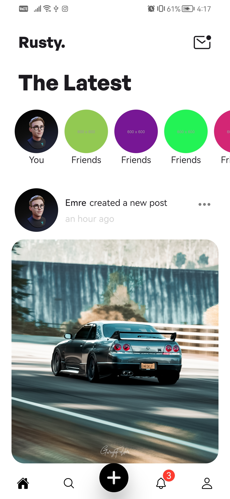
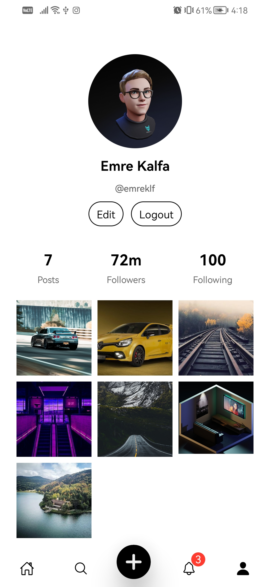

# React Native Social Media App

## Technologies

I used `React Native`, `Firebase`, `Typescript`...

## Requirements

| Requirements |  |
| --- | --- |
| Firebase | [Firebase](https://firebase.google.com)|
| Authentication | Firebase user authentication |
| Firestore | Create Firestore database for the posts |
| Storage | Create storage to store images |
| .env | Create your .env file for the API keys |

`Note:` After completing the installation, firebase will warn you about adding indexes via console. You can perform the indexing process by going to the link given in the console.

## Setup
- download or clone the repository
- run `npm install`
- run `npm run android || npm run ios`

